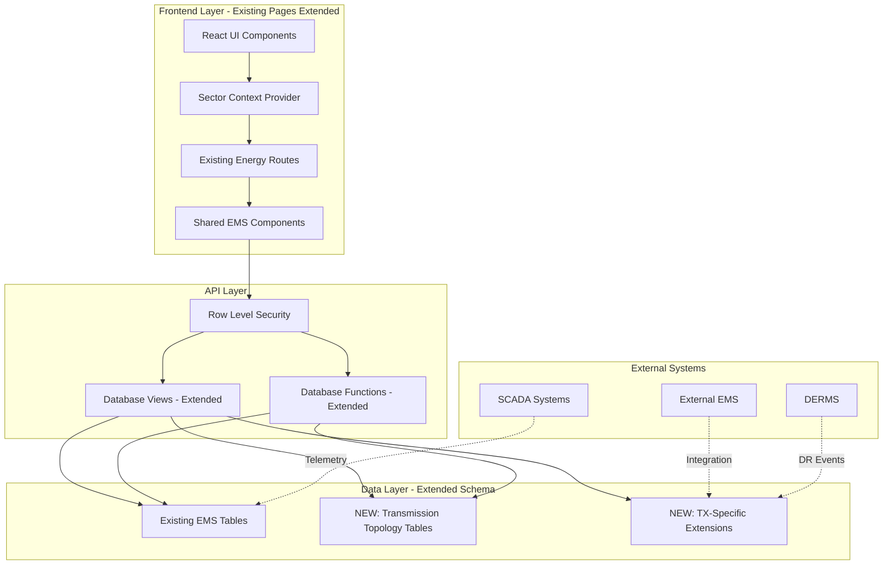
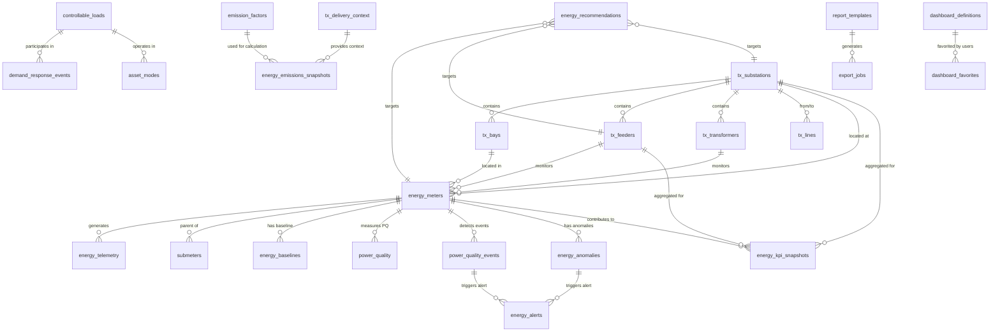
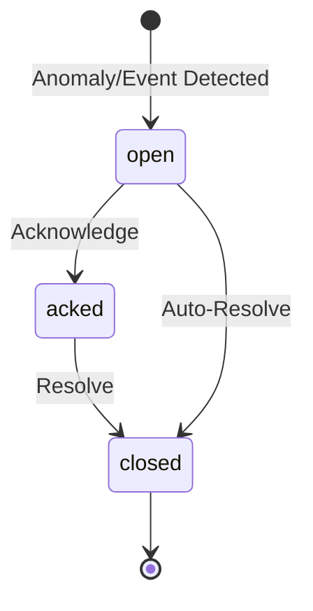
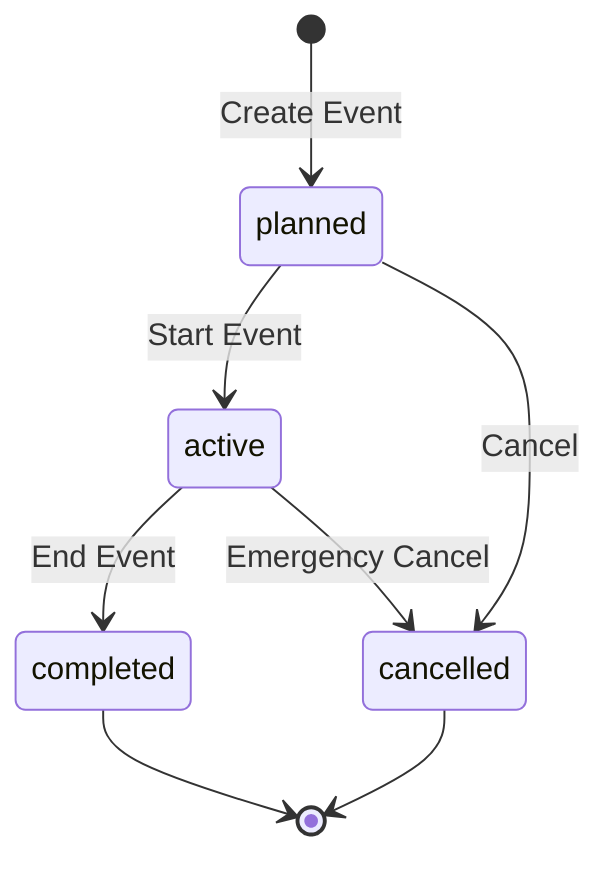
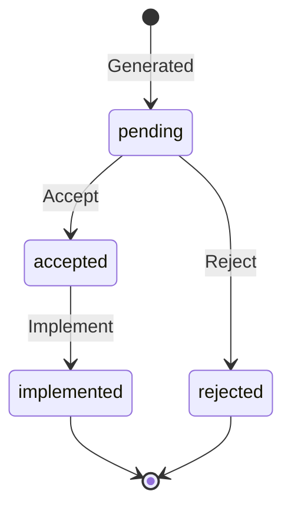

# Design Document: EMS Power Transmission

## Overview

The EMS Power Transmission system extends the existing Energy Management System to support electrical transmission grid operations. Rather than creating separate pages, this implementation **integrates transmission-specific features into the existing 26 energy management pages** using sector/subsector context switching.

The implementation follows a phased rollout approach across six feature sets, each building upon a foundational transmission context layer. This design emphasizes:

- **Sector-aware integration**: All transmission features are integrated into existing energy pages using sector context (Power/Transmission vs Oil & Gas/Upstream)
- **Grid topology awareness**: All energy data is contextualized within the physical transmission infrastructure (substations, feeders, transformers, lines)
- **Shared component reuse**: Common functionality is shared between sectors, with sector-specific extensions where needed
- **Time-series optimization**: Leveraging TimescaleDB hypertables for efficient telemetry storage and querying
- **Multi-tenancy and security**: Row-level security ensures data isolation across organizations
- **Idempotent data operations**: All migrations and seeds use CTE patterns with preconditions and postchecks
- **Comprehensive testing**: Property-based testing validates universal correctness properties across all data operations

The system is built on a TypeScript/React frontend with Supabase (PostgreSQL + TimescaleDB) backend, extending the existing nLVE (Navigate-List-View-Edit) pattern used across all energy management pages.

## Integration Strategy

### Existing Energy Pages (26 pages to extend)

**Energy Dashboards & Reporting (6 pages):**
1. EnergyDashboard.tsx - Extend with transmission grid KPIs
2. EnergyDashboardsAnomalies.tsx - Add transmission-specific anomaly types
3. EnergyDashboardsAuditReports.tsx - Include transmission compliance reports
4. EnergyDashboardsCostAnalysis.tsx - Add transmission tariff structures
5. EnergyDashboardsCustom.tsx - Enable transmission topology widgets
6. EnergyDashboardsPeriodComparison.tsx - Support transmission metrics

**Energy Monitoring & Metering (5 pages):**
7. EnergyMonitoringRealTime.tsx - Add transmission topology context (substations, feeders)
8. EnergyMonitoringBaselineTrends.tsx - Support transmission-specific baselines (kWh/MWh delivered)
9. EnergyMonitoringMultiFluid.tsx - Already supports electricity, extend with grid context
10. EnergyMonitoringPowerQuality.tsx - Add voltage-level-specific thresholds
11. EnergyMonitoringSubMetering.tsx - Support feeder-level sub-metering

**Energy Analytics & Optimisation (5 pages):**
12. EnergyAnalyticsAIOptimisation.tsx - Add transmission-specific recommendations
13. EnergyAnalyticsEfficiencyKPIs.tsx - Add transmission KPIs (losses %, load factor)
14. EnergyAnalyticsLoadProfiling.tsx - Support substation/feeder profiling
15. EnergyAnalyticsPeakDemand.tsx - Add demand window configurations
16. EnergyAnalyticsWasteDetection.tsx - Transmission-specific waste patterns

**Energy Control Advisory & Integration (5 pages):**
17. EnergyControlAssetModes.tsx - Add transformer tap changers, capacitor banks
18. EnergyControlDemandResponse.tsx - Support transmission DR events
19. EnergyControlEfficiencyCurves.tsx - Add transformer efficiency curves
20. EnergyControlIntegration.tsx - Add SCADA/EMS/DERMS integrations
21. EnergyControlLoadBalancing.tsx - Add feeder load balancing

**Sustainability & Emissions Tracking (5 pages):**
22. EnergySustainabilityCarbonCalculation.tsx - Add transmission delivery context
23. EnergySustainabilityCompliance.tsx - Add transmission-specific regulations
24. EnergySustainabilityEnergyIntensity.tsx - Add kgCO2e per MWh delivered
25. EnergySustainabilityESGReporting.tsx - Include transmission metrics
26. EnergySustainabilityRenewables.tsx - Support grid-connected renewables

**Energy Alerts (1 page):**
27. EnergyAlerts.tsx - Add transmission topology context to alerts

### Sector Context Switching Pattern

Each page will use the existing `useApp()` context to determine the current sector/subsector:

```typescript
const { sector, subsector } = useApp();
const isTransmission = sector === 'Power' && subsector === 'Transmission';
const isUpstream = sector === 'Oil & Gas' && subsector === 'Upstream';
```

Based on this context, pages will:
1. **Load appropriate data**: Transmission topology vs upstream assets
2. **Show relevant filters**: Substations/feeders vs wells/facilities
3. **Display sector-specific metrics**: Grid losses vs production efficiency
4. **Use appropriate terminology**: Feeders vs pipelines, substations vs facilities

## Architecture

### System Components



### Layered Architecture

The system extends the existing three-tier architecture:

1. **Presentation Layer** (React/TypeScript) - **EXTENDED**
   - Existing page components extended with transmission features
   - Sector context switching logic
   - Shared UI components reused across sectors
   - Conditional rendering based on sector/subsector
   - Typed interfaces for transmission-specific data

2. **API Layer** (Supabase) - **EXTENDED**
   - Existing RLS policies extended for transmission tables
   - New database views for transmission topology joins
   - New database functions for transmission calculations
   - Real-time subscriptions for transmission telemetry

3. **Data Layer** (PostgreSQL + TimescaleDB) - **EXTENDED**
   - Existing tables reused (energy_meters, energy_telemetry, etc.)
   - New transmission topology tables (tx_substations, tx_feeders, etc.)
   - Extended energy_meters table with transmission foreign keys
   - Existing hypertables reused for transmission telemetry

### Data Flow Patterns

**Telemetry Ingestion Flow:**
```
External System → API Endpoint → Validation → energy_telemetry (hypertable) → 
Continuous Aggregates → KPI Snapshots → Dashboard Widgets
```

**Alert Generation Flow:**
```
Telemetry → Baseline Comparison → Anomaly Detection → energy_anomalies → 
energy_alerts → Alert List UI → Acknowledgment/Resolution
```

**Report Generation Flow:**
```
User Request → Report Template → Query Execution → Data Aggregation → 
Export Job → File Generation → Download Link
```

## Components and Interfaces

### Database Schema Organization

The schema is organized into logical groups aligned with feature sets:


**Foundation Tables (Cycle 0):**
- `tx_substations`: Substation master data with natural key (org_id, code)
- `tx_bays`: Bay definitions within substations
- `tx_feeders`: Feeder circuits with direction and voltage level
- `tx_transformers`: Transformer specifications and ratings
- `tx_lines`: Transmission lines connecting substations
- `energy_meters` (extended): Added TX topology foreign keys and meter_role

**Monitoring Tables (FS1):**
- `energy_meters`: Core meter registry (reused from EMS baseline)
- `submeters`: Sub-meter hierarchy
- `energy_telemetry`: TimescaleDB hypertable for time-series data
- `energy_baselines`: Baseline definitions with TX-specific metrics
- `power_quality`: PQ telemetry time-series
- `power_quality_events`: Discrete PQ events with severity
- `tx_power_quality_limits`: Voltage-level-specific thresholds
- `tx_meter_channels`: Multi-channel meter configuration

**Analytics Tables (FS2):**
- `energy_kpi_snapshots`: Pre-computed KPI values by scope and period
- `energy_benchmarks`: Performance benchmarks for comparison
- `energy_recommendations`: Unified recommendations table
- `tx_demand_windows`: Utility-specific demand charge windows
- `energy_anomalies`: Detected anomalies with classification

**Control Tables (FS4):**
- `controllable_loads`: Registry of controllable equipment
- `generation_assets`: On-site generation inventory
- `demand_response_events`: DR event definitions and tracking
- `asset_modes`: Operational mode definitions
- `mode_recommendations`: Mode change recommendations
- `efficiency_curves`: Equipment efficiency curves
- `efficiency_recommendations`: Performance improvement recommendations
- `tx_control_integrations`: External system integration registry
- `tx_load_shedding_plans`: Load shedding plan definitions


**Sustainability Tables (FS3):**
- `emission_factors`: CO2e conversion factors with effective dates
- `tx_delivery_context`: Grid delivery metrics (MWh delivered, losses, interchange)
- `energy_emissions_snapshots`: Computed emissions by scope and period
- `tx_renewables_contracts`: PPA and REC tracking
- `tx_compliance_requirements`: Regulatory compliance definitions
- `tx_compliance_evidence`: Supporting documentation links

**Reporting Tables (FS5):**
- `report_templates`: Report definition templates
- `export_jobs`: Export job tracking and status
- `dashboard_definitions`: Custom dashboard configurations
- `dashboard_favorites`: User dashboard preferences

**Alert Tables (FS6):**
- `energy_alerts`: Unified alert tracking with state machine
- `energy_alert_activity`: Audit trail for alert actions
- `energy_tariffs`: Tariff definitions for cost calculations

### Key Database Views

**v_tx_energy_meter_registry:**
Joins meters with topology entities and includes latest telemetry timestamp. Used by all meter list pages.

```sql
SELECT 
  m.id, m.name, m.status, m.energy_types, m.meter_role,
  s.name as substation_name, f.name as feeder_name,
  t.name as transformer_name, b.bay_code,
  latest.timestamp as last_telemetry_at,
  latest.kw as current_kw
FROM energy_meters m
LEFT JOIN tx_substations s ON m.substation_id = s.id
LEFT JOIN tx_feeders f ON m.feeder_id = f.id
LEFT JOIN tx_transformers t ON m.transformer_id = t.id
LEFT JOIN tx_bays b ON m.bay_id = b.id
LEFT JOIN LATERAL (
  SELECT timestamp, kw 
  FROM energy_telemetry 
  WHERE meter_id = m.id 
  ORDER BY timestamp DESC 
  LIMIT 1
) latest ON true
```


**v_energy_alert_summary:**
Joins alerts with source anomalies/events and topology context for alert list pages.

```sql
SELECT 
  a.id, a.alert_state, a.severity, a.assigned_to, a.sla_due_at,
  a.source_type, a.source_id,
  CASE 
    WHEN a.source_type = 'anomaly' THEN an.detected_at
    WHEN a.source_type = 'pq_event' THEN pq.timestamp
  END as detected_at,
  m.name as meter_name,
  s.name as substation_name,
  f.name as feeder_name
FROM energy_alerts a
LEFT JOIN energy_anomalies an ON a.source_type = 'anomaly' AND a.source_id = an.id
LEFT JOIN power_quality_events pq ON a.source_type = 'pq_event' AND a.source_id = pq.id
LEFT JOIN energy_meters m ON COALESCE(an.meter_id, pq.meter_id) = m.id
LEFT JOIN tx_substations s ON m.substation_id = s.id
LEFT JOIN tx_feeders f ON m.feeder_id = f.id
```

### Key Database Functions

**fn_tx_latest_meter_snapshot(meter_id UUID):**
Returns latest telemetry point plus PQ summary for a specific meter.

**fn_calculate_energy_consumption(meter_id UUID, start_ts TIMESTAMPTZ, end_ts TIMESTAMPTZ):**
Calculates total kWh consumption for a meter within a time window.

**fn_calculate_energy_intensity(org_id UUID, period_start DATE, period_end DATE):**
Calculates kgCO2e per MWh delivered and losses percentage for a period.

**fn_detect_anomalies(meter_id UUID, threshold_pct NUMERIC):**
Compares recent telemetry to baseline and flags anomalies exceeding threshold.

### TypeScript Interfaces


**Core Domain Types:**

```typescript
export interface TxSubstation {
  id: string;
  org_id: string;
  code: string;
  name: string;
  region?: string;
  voltage_levels_kv?: number[];
  geo?: GeoJSON;
  active: boolean;
  created_at: string;
  updated_at: string;
}

export interface TxFeeder {
  id: string;
  substation_id: string;
  feeder_code: string;
  name: string;
  voltage_level_kv?: number;
  direction?: 'incomer' | 'outgoer';
  utility_ref?: string;
  active: boolean;
}

export interface EnergyMeter {
  id: string;
  org_id: string;
  name: string;
  status: 'Normal' | 'High' | 'Critical';
  energy_types: ('electricity' | 'gas' | 'diesel' | 'steam')[];
  meter_role?: 'grid_incomer' | 'feeder_outgoing' | 'transformer_lv' | 
                'station_service' | 'line_monitoring';
  substation_id?: string;
  feeder_id?: string;
  bay_id?: string;
  transformer_id?: string;
  active: boolean;
}

export interface EnergyTelemetry {
  meter_id: string;
  timestamp: string;
  kw?: number;
  kwh?: number;
  voltage_v?: number;
  current_a?: number;
  frequency_hz?: number;
  power_factor?: number;
  thd_pct?: number;
}

export interface EnergyBaseline {
  id: string;
  meter_id: string;
  baseline_start_date: string;
  baseline_end_date: string;
  baseline_kwh_per_day?: number;
  baseline_kwh_per_mwh_delivered?: number;
  baseline_kwh_per_mw_peak?: number;
  baseline_method?: 'regression' | 'seasonal' | 'rolling';
  confidence_level?: number;
}
```


```typescript
export interface PowerQualityEvent {
  id: string;
  meter_id: string;
  event_type: 'sag' | 'swell' | 'thd_high' | 'frequency_deviation' | 'pf_low';
  timestamp: string;
  duration_ms?: number;
  severity: 'Low' | 'Medium' | 'High' | 'Critical';
  magnitude?: number;
  resolved: boolean;
  resolved_at?: string;
  resolution_notes?: string;
  description?: string;
}

export interface EnergyAlert {
  id: string;
  source_type: 'anomaly' | 'pq_event';
  source_id: string;
  alert_state: 'open' | 'acked' | 'closed';
  severity: 'Low' | 'Medium' | 'High' | 'Critical';
  assigned_to?: string;
  ack_at?: string;
  close_at?: string;
  sla_due_at?: string;
  tags?: string[];
  notes?: string;
}

export interface EnergyKPISnapshot {
  id: string;
  kpi_code: string;
  scope_type: 'org' | 'substation' | 'feeder' | 'meter';
  scope_id: string;
  period_start: string;
  period_grain: 'hour' | 'day' | 'week' | 'month';
  value: number;
  unit: string;
  metadata?: Record<string, any>;
}

export interface EnergyRecommendation {
  id: string;
  recommendation_type: 'waste' | 'efficiency' | 'peak_shaving' | 'ai_optimization';
  scope_type: 'substation' | 'feeder' | 'meter' | 'load';
  scope_id: string;
  title: string;
  description: string;
  estimated_savings_kwh?: number;
  estimated_savings_cost?: number;
  confidence_level?: number;
  timeframe?: string;
  status: 'pending' | 'accepted' | 'rejected' | 'implemented';
  created_at: string;
}
```


```typescript
export interface DemandResponseEvent {
  id: string;
  org_id: string;
  event_name: string;
  event_window_start: string;
  event_window_end: string;
  target_reduction_kw: number;
  actual_reduction_kw?: number;
  participating_loads: string[]; // array of controllable_load IDs
  event_status: 'planned' | 'active' | 'completed' | 'cancelled';
  created_by: string;
}

export interface ControllableLoad {
  id: string;
  org_id: string;
  name: string;
  load_capacity_kw: number;
  current_mode?: string;
  available_modes: string[];
  control_constraints?: Record<string, any>;
  last_mode_change_at?: string;
}

export interface EmissionSnapshot {
  id: string;
  scope_type: 'org' | 'substation' | 'feeder';
  scope_id: string;
  period_start: string;
  period_grain: 'day' | 'month' | 'year';
  factor_id: string;
  co2e_kg: number;
  energy_kwh: number;
  energy_type: 'electricity' | 'gas' | 'diesel' | 'steam';
}

export interface DashboardDefinition {
  id: string;
  org_id: string;
  dashboard_code: string;
  name: string;
  description?: string;
  config: {
    widgets: DashboardWidget[];
    layout: any;
  };
  version: number;
  owner_id: string;
  published: boolean;
}

export interface DashboardWidget {
  widget_id: string;
  widget_type: 'kpi_tile' | 'trend_chart' | 'table' | 'gauge';
  title: string;
  query_config: {
    dataset: string;
    filters?: Record<string, any>;
    aggregation?: string;
  };
  position: { x: number; y: number; w: number; h: number };
}
```

## Data Models


### Entity Relationship Diagram



### State Machines

**Alert State Machine:**




**DR Event State Machine:**



**Recommendation Status Flow:**



### Data Validation Rules

**Topology Constraints:**
- Substations: (org_id, code) must be unique
- Feeders: (substation_id, feeder_code) must be unique
- Transformers: (substation_id, transformer_code) must be unique
- Lines: from_substation_id ≠ to_substation_id
- Meters with role='grid_incomer' must have substation_id NOT NULL
- Meters with role='feeder_outgoing' must have feeder_id NOT NULL

**Temporal Constraints:**
- Baselines: (meter_id, period) must not overlap
- Telemetry: timestamp must be <= NOW() and >= (NOW() - 1 year)
- DR Events: event_window_end > event_window_start
- Emission factors: effective_date must be <= consumption date

**Business Rules:**
- Sub-meter sum should not exceed parent meter by > 5% tolerance
- DR event participating loads must exist and be controllable
- KPI snapshots must exist for all active substations/feeders
- Emission factors must exist for all consumption periods


## Correctness Properties

*A property is a characteristic or behavior that should hold true across all valid executions of a system—essentially, a formal statement about what the system should do. Properties serve as the bridge between human-readable specifications and machine-verifiable correctness guarantees.*

The following properties define the correctness criteria for the EMS Power Transmission system. Each property is universally quantified and references the specific requirements it validates.

### Foundation and Topology Properties

**Property 1: Substation uniqueness**
*For any* organization and any two substations within that organization, if they have the same code, then they must be the same substation (enforcing natural key uniqueness).
**Validates: Requirements 1.1**

**Property 2: Feeder uniqueness within substation**
*For any* substation and any two feeders within that substation, if they have the same feeder_code, then they must be the same feeder.
**Validates: Requirements 1.2**

**Property 3: Transformer uniqueness within substation**
*For any* substation and any two transformers within that substation, if they have the same transformer_code, then they must be the same transformer.
**Validates: Requirements 1.3**

**Property 4: Transmission line endpoint validity**
*For any* transmission line, both from_substation_id and to_substation_id must reference existing substations, and they must not be equal.
**Validates: Requirements 1.4**

**Property 5: Meter role topology consistency**
*For any* energy meter, if meter_role is 'grid_incomer' then substation_id must not be null, and if meter_role is 'feeder_outgoing' then feeder_id must not be null.
**Validates: Requirements 1.5, 2.2, 2.3**

**Property 6: Seed idempotency**
*For any* seed script, running it twice should produce the same final database state as running it once (no duplicate entities created).
**Validates: Requirements 1.7, 30.5**

**Property 7: CTE validation completeness**
*For any* seed or migration with CTEs, preconditions must validate all foreign key references exist, and postchecks must validate row counts, uniqueness, and referential integrity.
**Validates: Requirements 1.8, 30.4**


### Meter Registry and Telemetry Properties

**Property 8: Meter staleness detection**
*For any* meter and any configurable staleness threshold, if the meter's last telemetry timestamp is older than (NOW() - threshold), then the meter should be flagged as having stale data.
**Validates: Requirements 2.6**

**Property 9: Meter filtering correctness**
*For any* meter list query with filters (substation, feeder, role, status, energy_type, stale flag), all returned meters must match all applied filters.
**Validates: Requirements 2.7**

**Property 10: Latest telemetry accuracy**
*For any* meter, the last_telemetry_at timestamp in the meter registry view must equal the maximum timestamp from energy_telemetry for that meter.
**Validates: Requirements 2.5**

### Baseline and Anomaly Properties

**Property 11: Baseline non-overlap**
*For any* meter and any two baselines for that meter, their date ranges (baseline_start_date to baseline_end_date) must not overlap.
**Validates: Requirements 4.3**

**Property 12: Anomaly detection threshold consistency**
*For any* meter with a baseline, if actual consumption deviates from baseline by more than the configured threshold percentage, then an anomaly should be detected.
**Validates: Requirements 4.5**

### Power Quality Properties

**Property 13: PQ event threshold enforcement**
*For any* power quality telemetry point, if voltage, frequency, THD, or power factor exceeds the defined thresholds for that voltage level, then a power quality event should be created.
**Validates: Requirements 6.2, 6.3**

**Property 14: PQ event resolution tracking**
*For any* power quality event, if it is resolved, then resolved_at must not be null and must be >= timestamp (event occurrence time).
**Validates: Requirements 6.6**

### Sub-Metering Properties

**Property 15: Sub-meter sum validation**
*For any* parent meter and its sub-meters over any time period, the sum of sub-meter consumption should not exceed parent meter consumption by more than 5% tolerance.
**Validates: Requirements 7.3**

**Property 16: Sub-meter hierarchy validity**
*For any* sub-meter, the parent_meter_id must reference an existing meter, and the sub-meter's location must be within the parent meter's scope.
**Validates: Requirements 7.1, 7.6**


### Alert Management Properties

**Property 17: Alert state machine validity**
*For any* alert, state transitions must follow the valid paths: open → acked → closed, or open → closed, and timestamps must be monotonically increasing (ack_at >= created_at, close_at >= ack_at).
**Validates: Requirements 8.4, 8.5**

**Property 18: Alert source linkage**
*For any* alert, the source_id must reference either an existing anomaly (if source_type='anomaly') or an existing power quality event (if source_type='pq_event').
**Validates: Requirements 8.1, 8.2**

**Property 19: Alert filtering correctness**
*For any* alert list query with filters (state, severity, type, substation, feeder, assignee), all returned alerts must match all applied filters.
**Validates: Requirements 8.9**

### KPI and Analytics Properties

**Property 20: KPI snapshot uniqueness**
*For any* KPI snapshot, the combination (kpi_code, scope_type, scope_id, period_start, period_grain) must be unique.
**Validates: Requirements 9.2**

**Property 21: KPI coverage completeness**
*For any* active substation or feeder and any recent time period, KPI snapshots should exist for all defined KPI codes.
**Validates: Requirements 9.4**

**Property 22: Load profile aggregation correctness**
*For any* meter and any time period, aggregating telemetry by the specified interval (15-min, hourly, daily) should produce non-overlapping time buckets that cover the entire period.
**Validates: Requirements 10.1**

**Property 23: Peak demand identification**
*For any* demand window and any set of telemetry data, the identified peak demand must be the maximum kW value within that window.
**Validates: Requirements 10.2**

**Property 24: Recommendation uniqueness**
*For any* recommendation, the combination (recommendation_type, scope_type, scope_id, created_at::date, title) must be unique.
**Validates: Requirements 11.7**


### Control and Demand Response Properties

**Property 25: DR event load validation**
*For any* demand response event, all participating_loads must reference existing controllable loads, and the sum of load capacities must be >= target_reduction_kw.
**Validates: Requirements 14.2**

**Property 26: DR event constraint enforcement**
*For any* DR event and any load shedding plan, the event must not exceed the maximum shed constraints defined in the plan.
**Validates: Requirements 14.3**

**Property 27: Asset mode validity**
*For any* controllable load and any mode recommendation, the recommended mode must be in the load's available_modes list.
**Validates: Requirements 13.3**

**Property 28: Load balancing capacity validation**
*For any* load balancing recommendation that suggests transferring load from feeder A to feeder B, feeder B's current load plus the transfer amount must not exceed feeder B's capacity.
**Validates: Requirements 15.3**

### Sustainability and Emissions Properties

**Property 29: Emission factor temporal validity**
*For any* emissions calculation, the emission factor used must have an effective_date <= the consumption date.
**Validates: Requirements 18.2**

**Property 30: Emissions snapshot uniqueness**
*For any* emissions snapshot, the combination (scope_type, scope_id, period_start, period_grain, factor_id) must be unique.
**Validates: Requirements 18.3**

**Property 31: Energy intensity calculation correctness**
*For any* period with delivery context, energy intensity (kgCO2e per MWh delivered) must equal total emissions divided by MWh delivered.
**Validates: Requirements 19.2**

**Property 32: Renewable percentage calculation**
*For any* period, renewable percentage must equal (renewable generation kWh / total consumption kWh) * 100, and must be between 0 and 100.
**Validates: Requirements 20.3**


### Dashboard and Reporting Properties

**Property 33: Dashboard widget query whitelist enforcement**
*For any* custom dashboard widget, the query_config.dataset must be in the whitelist of allowed datasets.
**Validates: Requirements 24.2**

**Property 34: Dashboard definition versioning**
*For any* dashboard definition, when it is updated, the version number must increment, and the previous version must be preserved for audit.
**Validates: Requirements 24.4**

**Property 35: Export job status tracking**
*For any* export job, the status must progress through valid states (pending → running → completed/failed), and timestamps must be monotonically increasing.
**Validates: Requirements 26.3**

**Property 36: Period comparison normalization**
*For any* period comparison with different period lengths, metrics must be normalized (e.g., per-day averages) before comparison.
**Validates: Requirements 25.5**

### Security and Data Quality Properties

**Property 37: RLS org isolation**
*For any* user and any query on energy tables, the results must only include rows where org_id matches the user's organization (unless user has cross-org admin role).
**Validates: Requirements 27.1**

**Property 38: RLS site filtering**
*For any* user with site-specific permissions, query results must be further filtered to only include data for authorized sites.
**Validates: Requirements 27.2**

**Property 39: Telemetry timestamp validity**
*For any* telemetry data point, the timestamp must be <= NOW() and >= (NOW() - 1 year).
**Validates: Requirements 28.1**

**Property 40: Orphan detection**
*For any* meter, if it references a substation_id, feeder_id, bay_id, or transformer_id, those entities must exist in their respective tables.
**Validates: Requirements 28.2, 28.8**

**Property 41: Migration idempotency**
*For any* migration script, running it multiple times should produce the same final schema state (using IF NOT EXISTS or equivalent).
**Validates: Requirements 30.1**

**Property 42: Upsert natural key consistency**
*For any* seed upsert operation, the natural key used for conflict resolution must match the unique constraint defined on the table.
**Validates: Requirements 30.2**


## Error Handling

### Database-Level Error Handling

**Constraint Violations:**
- Unique constraint violations return specific error codes (23505 in PostgreSQL)
- Foreign key violations return error code 23503 with details about the missing reference
- Check constraint violations return error code 23514 with the constraint name
- All constraint errors should be caught and translated to user-friendly messages

**RLS Denial:**
- When RLS policies deny access, return HTTP 403 with message "Insufficient access to this resource"
- Never expose internal RLS policy logic in error messages
- Log RLS denials for security audit purposes

**Data Quality Errors:**
- Telemetry timestamp out of bounds: reject with "Timestamp must be within the last year"
- Baseline overlap: reject with "Baseline period overlaps with existing baseline"
- Sub-meter sum exceeds parent: create data quality alert rather than rejecting
- Missing emission factors: flag as data quality issue and prevent emissions calculation

### Application-Level Error Handling

**Query Errors:**
- Connection timeouts: retry up to 3 times with exponential backoff
- Query timeouts: return partial results with warning if pagination allows
- Empty result sets: display appropriate empty state UI, not error message
- Malformed queries: log error details, show generic "Unable to load data" to user

**State Transition Errors:**
- Invalid alert state transition: return "Cannot transition from {current} to {requested}"
- DR event conflicts: return "Event conflicts with existing event {id}"
- Mode change validation failure: return "Mode {mode} not available for this load"

**Permission Errors:**
- Insufficient role for operation: return "This action requires {role} role"
- Cross-organization access denied: return "Access denied to resources outside your organization"
- Site-level access denied: return "Access denied to this site"

**Integration Errors:**
- SCADA connection failure: mark integration as disconnected, create alert
- Data sync failure: log error, retry according to retry policy, alert after max retries
- Protocol errors: log full error details, show "Integration communication error" to user


### Graceful Degradation

**Missing Data Scenarios:**
- No telemetry for meter: show "No data available" with last known timestamp
- No baseline defined: show actual consumption without comparison
- Missing emission factors: show consumption data, flag emissions as "Cannot calculate"
- No topology assignment: show meter data without topology context

**Performance Degradation:**
- If query exceeds latency budget: return cached/stale data with timestamp
- If dashboard widgets timeout: show error state for that widget, load others
- If export job queue is full: return "Export service busy, try again later"

**Partial Failures:**
- If some meters fail to load: show available meters with warning banner
- If some KPIs fail to calculate: show available KPIs, log failures
- If some alerts fail to create: create what's possible, log failures for retry

## Testing Strategy

### Dual Testing Approach

The EMS Power Transmission system requires both unit tests and property-based tests to ensure comprehensive correctness validation:

**Unit Tests:**
- Verify specific examples and edge cases
- Test integration points between components
- Validate error conditions and error messages
- Test UI component rendering and interactions
- Verify permission checks and RLS policy application
- Test state machine transitions with specific scenarios

**Property-Based Tests:**
- Verify universal properties across all inputs
- Test data integrity constraints with generated data
- Validate idempotency of migrations and seeds
- Test calculation correctness across ranges of values
- Verify filtering and aggregation logic with random datasets
- Test constraint enforcement with boundary conditions

Both testing approaches are complementary and necessary. Unit tests catch concrete bugs in specific scenarios, while property-based tests verify general correctness across the input space.

### Property-Based Testing Configuration

**Framework:** fast-check (TypeScript/JavaScript property-based testing library)

**Test Configuration:**
- Minimum 100 iterations per property test (due to randomization)
- Each property test must reference its design document property
- Tag format: `// Feature: ems-transmission-full, Property {number}: {property_text}`

**Example Property Test Structure:**

```typescript
import fc from 'fast-check';

// Feature: ems-transmission-full, Property 1: Substation uniqueness
test('substations within an org must have unique codes', () => {
  fc.assert(
    fc.property(
      fc.array(fc.record({
        org_id: fc.uuid(),
        code: fc.string({ minLength: 1, maxLength: 20 }),
        name: fc.string()
      })),
      async (substations) => {
        // Test that attempting to insert substations with duplicate (org_id, code)
        // either fails or results in only one substation per unique combination
        const result = await upsertSubstations(substations);
        const uniquePairs = new Set(result.map(s => `${s.org_id}:${s.code}`));
        expect(uniquePairs.size).toBe(result.length);
      }
    ),
    { numRuns: 100 }
  );
});
```


### Test Coverage Requirements

**Database Layer:**
- All unique constraints tested with property-based tests
- All foreign key constraints tested with property-based tests
- All check constraints tested with boundary value tests
- All RLS policies tested with multi-tenant scenarios
- All database functions tested with property-based tests for calculation correctness
- All views tested for correct joins and field inclusion
- Migration idempotency tested by running migrations twice
- Seed idempotency tested by running seeds twice

**API Layer:**
- All query functions tested with various filter combinations
- All mutation functions tested with valid and invalid inputs
- All permission checks tested with different user roles
- All error conditions tested with specific error scenarios
- All pagination logic tested with various page sizes and offsets

**UI Layer:**
- All nLVE pages tested for rendering without errors
- All list filters tested for correct filtering behavior
- All forms tested for validation and submission
- All state transitions tested for UI updates
- All error states tested for appropriate messaging
- All empty states tested for appropriate messaging
- All loading states tested for appropriate indicators

### Performance Testing

**Query Performance Targets:**
- Meter list queries: < 2 seconds for 10,000 meters
- Telemetry time-series queries: < 3 seconds for 1 million points
- Dashboard widget queries: < 5 seconds total for all widgets
- KPI aggregation queries: < 4 seconds for monthly aggregates
- Export generation: < 30 seconds for 100,000 rows

**Load Testing Scenarios:**
- Concurrent user load: 100 simultaneous users
- Telemetry ingestion rate: 10,000 points per second
- Alert generation rate: 1,000 alerts per minute
- Export job queue: 50 concurrent export jobs

**Performance Validation:**
- Use EXPLAIN ANALYZE to verify index usage
- Monitor query execution plans for sequential scans on large tables
- Use TimescaleDB continuous aggregates for frequently accessed aggregations
- Implement cursor-based pagination for large result sets
- Cache dashboard widget results with appropriate TTL

### Integration Testing

**End-to-End Workflows:**
- Telemetry ingestion → anomaly detection → alert creation → alert resolution
- Baseline creation → consumption comparison → waste detection → recommendation
- DR event planning → load validation → event execution → performance tracking
- Emissions calculation → snapshot storage → ESG report generation → export
- Custom dashboard creation → widget configuration → data query → rendering

**Cross-Feature Integration:**
- Topology changes propagate to meter registry views
- Meter status changes trigger alert updates
- Baseline updates trigger anomaly recalculation
- DR events update controllable load status
- Emission factor updates trigger emissions recalculation

### Continuous Integration

**Automated Test Execution:**
- All unit tests run on every commit
- All property-based tests run on every commit
- Integration tests run on pull requests
- Performance tests run nightly
- Data validation queries run on every deployment

**Quality Gates:**
- All tests must pass before merge
- Code coverage must be >= 80%
- No new linting errors
- No new TypeScript errors
- Database migrations must be reversible
- Seeds must pass all postchecks

This comprehensive testing strategy ensures that the EMS Power Transmission system maintains high quality, correctness, and performance throughout its development and operation.
