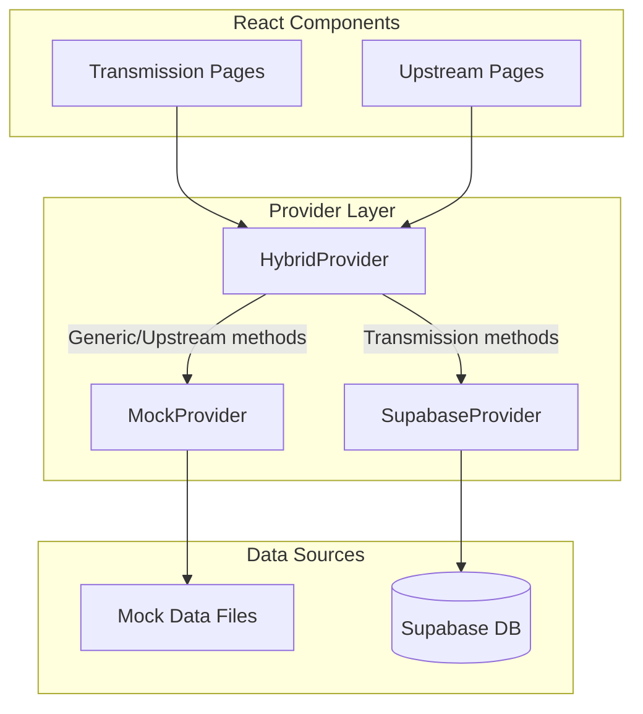

# Design Document: Hybrid Data Provider for Power Transmission

## Overview

This design introduces a hybrid data provider architecture that enables Power Transmission pages to use Supabase while keeping Upstream Oil & Gas pages on local mocks. The key insight is to create Transmission-specific provider methods that route to Supabase, while existing generic methods continue routing to MockProvider.

The architecture follows the existing provider pattern established in Phase A & B, adding:
1. A `HybridProvider` that delegates based on method type
2. New Transmission-specific methods in the `DataProvider` interface
3. Database schema for core + Power Transmission domain tables
4. Seed data for a canonical Transmission demo tenant

## Architecture



### Provider Selection Logic

```typescript
// Environment variable controls mode
VITE_DATA_BACKEND = 'mock' | 'supabase' | 'hybrid'

// Factory returns appropriate provider
getDataProvider():
  if backend === 'hybrid' → HybridProvider
  if backend === 'supabase' → SupabaseProvider
  else → MockProvider
```

### Method Routing in HybridProvider

```typescript
// Transmission-specific methods → SupabaseProvider
getTransmissionTenants()
getGridNodesByTenant(tenantId)
getGridLinesByTenant(tenantId)
getTransmissionAssetsByTenant(tenantId)
getTransmissionOverviewKpis(tenantId)

// All other methods → MockProvider
getTenants()
getAssetsByTenant(tenantId)
getUpstreamAssetsByTenant(tenantId)
// ... etc
```

## Components and Interfaces

### Extended DataProvider Interface

```typescript
interface DataProvider {
  // Existing methods (unchanged)
  getTenants(): Promise<Tenant[]>;
  getTenantsBySector(sectorId: string): Promise<Tenant[]>;
  getAssetsByTenant(tenantId: string): Promise<Asset[]>;
  // ... other existing methods

  // NEW: Transmission-specific methods
  getTransmissionTenants(): Promise<TransmissionTenant[]>;
  getGridNodesByTenant(tenantId: string): Promise<GridNode[]>;
  getGridLinesByTenant(tenantId: string): Promise<GridLine[]>;
  getTransmissionAssetsByTenant(tenantId: string): Promise<TransmissionAsset[]>;
  getTransmissionOverviewKpis(tenantId: string): Promise<TransmissionKpis>;
}
```

### HybridProvider Class

```typescript
class HybridProvider implements DataProvider {
  private mockProvider: MockProvider;
  private supabaseProvider: SupabaseProvider;

  // Transmission methods delegate to Supabase
  async getTransmissionTenants(): Promise<TransmissionTenant[]> {
    return this.supabaseProvider.getTransmissionTenants();
  }

  async getGridNodesByTenant(tenantId: string): Promise<GridNode[]> {
    return this.supabaseProvider.getGridNodesByTenant(tenantId);
  }

  // Generic methods delegate to Mock
  async getTenants(): Promise<Tenant[]> {
    return this.mockProvider.getTenants();
  }

  async getAssetsByTenant(tenantId: string): Promise<Asset[]> {
    return this.mockProvider.getAssetsByTenant(tenantId);
  }
}
```

### Updated Provider Factory

```typescript
// src/lib/data/index.ts
function getDataProvider(): DataProvider {
  const backend = getDataBackend();
  
  if (backend === 'hybrid') {
    return getHybridProvider();
  }
  if (backend === 'supabase') {
    return getSupabaseProvider();
  }
  return getMockProvider();
}

function getDataBackend(): 'mock' | 'supabase' | 'hybrid' {
  return (import.meta.env.VITE_DATA_BACKEND || 'mock') as 'mock' | 'supabase' | 'hybrid';
}
```

## Data Models

### TypeScript Types

```typescript
// src/types/transmission.ts

export interface TransmissionTenant {
  id: string;
  name: string;
  sector: 'power';
  subsector: 'transmission';
  scenarioTag: string;
}

export interface GridNode {
  id: string;
  tenantId: string;
  siteId: string | null;
  name: string;
  nodeType: 'substation' | 'junction' | 'plant';
  voltageKv: number;
  region: string;
  geoLat: number | null;
  geoLng: number | null;
}

export interface GridLine {
  id: string;
  tenantId: string;
  name: string;
  fromNodeId: string;
  toNodeId: string;
  voltageKv: number;
  lengthKm: number;
  status: 'active' | 'maintenance' | 'offline';
}

export interface GridAssetLink {
  assetId: string;
  nodeId: string | null;
  lineId: string | null;
}

export interface TransmissionAsset {
  id: string;
  tenantId: string;
  siteId: string;
  assetTypeId: string;
  assetTypeCode: string;  // TRANSFORMER, BREAKER, BAY, METER
  assetTypeName: string;
  name: string;
  status: 'online' | 'offline' | 'maintenance';
  criticality: 'low' | 'medium' | 'high' | 'critical';
  parentAssetId: string | null;
  properties: Record<string, unknown>;
}

export interface TransmissionKpis {
  totalAssets: number;
  onlineAssets: number;
  offlineAssets: number;
  maintenanceAssets: number;
  criticalAlerts: number;
  warningAlerts: number;
  totalGridNodes: number;
  totalGridLines: number;
  activeLines: number;
}
```

### Database Schema

#### Core Schema (public)

```sql
-- tenants: Multi-sector tenant registry
CREATE TABLE tenants (
  id UUID PRIMARY KEY DEFAULT gen_random_uuid(),
  name TEXT NOT NULL,
  sector TEXT NOT NULL,           -- 'power', 'oil_gas', etc.
  subsector TEXT,                 -- 'transmission', 'upstream', etc.
  scenario_tag TEXT,              -- 'power_transmission_demo_v1'
  created_at TIMESTAMPTZ DEFAULT now(),
  updated_at TIMESTAMPTZ DEFAULT now()
);

-- sites: Physical locations
CREATE TABLE sites (
  id UUID PRIMARY KEY DEFAULT gen_random_uuid(),
  tenant_id UUID NOT NULL REFERENCES tenants(id) ON DELETE CASCADE,
  name TEXT NOT NULL,
  region TEXT,
  geo_lat DOUBLE PRECISION,
  geo_lng DOUBLE PRECISION,
  created_at TIMESTAMPTZ DEFAULT now()
);

-- asset_types: Asset classification
CREATE TABLE asset_types (
  id UUID PRIMARY KEY DEFAULT gen_random_uuid(),
  tenant_id UUID NOT NULL REFERENCES tenants(id) ON DELETE CASCADE,
  code TEXT NOT NULL,             -- 'TRANSFORMER', 'BREAKER', etc.
  name TEXT NOT NULL,
  category TEXT,
  properties_schema JSONB,        -- Optional JSON schema for properties
  UNIQUE(tenant_id, code)
);

-- assets: Physical/logical assets
CREATE TABLE assets (
  id UUID PRIMARY KEY DEFAULT gen_random_uuid(),
  tenant_id UUID NOT NULL REFERENCES tenants(id) ON DELETE CASCADE,
  site_id UUID REFERENCES sites(id) ON DELETE SET NULL,
  asset_type_id UUID REFERENCES asset_types(id) ON DELETE SET NULL,
  name TEXT NOT NULL,
  status TEXT DEFAULT 'online',   -- 'online', 'offline', 'maintenance'
  criticality TEXT DEFAULT 'medium',
  parent_asset_id UUID REFERENCES assets(id) ON DELETE SET NULL,
  properties JSONB DEFAULT '{}',
  created_at TIMESTAMPTZ DEFAULT now(),
  updated_at TIMESTAMPTZ DEFAULT now()
);

-- alerts: Cross-domain alerts
CREATE TABLE alerts (
  id UUID PRIMARY KEY DEFAULT gen_random_uuid(),
  tenant_id UUID NOT NULL REFERENCES tenants(id) ON DELETE CASCADE,
  source_type TEXT NOT NULL,      -- 'asset', 'grid_node', 'grid_line', 'security', 'automation'
  source_id UUID,
  severity TEXT NOT NULL,         -- 'info', 'warning', 'critical'
  status TEXT DEFAULT 'open',     -- 'open', 'acknowledged', 'in-progress', 'closed'
  title TEXT NOT NULL,
  created_at TIMESTAMPTZ DEFAULT now(),
  payload JSONB DEFAULT '{}'
);

-- tags: Protocol/address mapping for telemetry
CREATE TABLE tags (
  id UUID PRIMARY KEY DEFAULT gen_random_uuid(),
  tenant_id UUID NOT NULL REFERENCES tenants(id) ON DELETE CASCADE,
  asset_id UUID REFERENCES assets(id) ON DELETE CASCADE,
  protocol TEXT NOT NULL,         -- 'OPC-UA', 'Modbus', 'MQTT'
  address TEXT NOT NULL,
  name TEXT,
  created_at TIMESTAMPTZ DEFAULT now()
);

-- telemetry_points: Metric definitions
CREATE TABLE telemetry_points (
  id UUID PRIMARY KEY DEFAULT gen_random_uuid(),
  tenant_id UUID NOT NULL REFERENCES tenants(id) ON DELETE CASCADE,
  asset_id UUID REFERENCES assets(id) ON DELETE CASCADE,
  tag_id UUID REFERENCES tags(id) ON DELETE SET NULL,
  metric TEXT NOT NULL,           -- 'voltage', 'current', 'temperature', etc.
  unit TEXT,                      -- 'kV', 'A', '°C', etc.
  limits JSONB,                   -- { "min": 0, "max": 100, "warning": 80, "critical": 95 }
  created_at TIMESTAMPTZ DEFAULT now()
);

-- Indexes for common queries
CREATE INDEX idx_sites_tenant ON sites(tenant_id);
CREATE INDEX idx_assets_tenant ON assets(tenant_id);
CREATE INDEX idx_assets_site ON assets(site_id);
CREATE INDEX idx_alerts_tenant ON alerts(tenant_id);
CREATE INDEX idx_alerts_created ON alerts(created_at DESC);
CREATE INDEX idx_telemetry_asset ON telemetry_points(asset_id);
```

#### Power Transmission Domain Schema

```sql
-- grid_nodes: Transmission network topology nodes
CREATE TABLE grid_nodes (
  id UUID PRIMARY KEY DEFAULT gen_random_uuid(),
  tenant_id UUID NOT NULL REFERENCES tenants(id) ON DELETE CASCADE,
  site_id UUID REFERENCES sites(id) ON DELETE SET NULL,
  name TEXT NOT NULL,
  node_type TEXT NOT NULL,        -- 'substation', 'junction', 'plant'
  voltage_kv DOUBLE PRECISION,
  region TEXT,
  geo_lat DOUBLE PRECISION,
  geo_lng DOUBLE PRECISION,
  created_at TIMESTAMPTZ DEFAULT now()
);

-- grid_lines: Transmission lines connecting nodes
CREATE TABLE grid_lines (
  id UUID PRIMARY KEY DEFAULT gen_random_uuid(),
  tenant_id UUID NOT NULL REFERENCES tenants(id) ON DELETE CASCADE,
  name TEXT NOT NULL,
  from_node_id UUID NOT NULL REFERENCES grid_nodes(id) ON DELETE CASCADE,
  to_node_id UUID NOT NULL REFERENCES grid_nodes(id) ON DELETE CASCADE,
  voltage_kv DOUBLE PRECISION,
  length_km DOUBLE PRECISION,
  status TEXT DEFAULT 'active',   -- 'active', 'maintenance', 'offline'
  created_at TIMESTAMPTZ DEFAULT now()
);

-- grid_asset_links: Links assets to topology
CREATE TABLE grid_asset_links (
  id UUID PRIMARY KEY DEFAULT gen_random_uuid(),
  asset_id UUID NOT NULL REFERENCES assets(id) ON DELETE CASCADE,
  node_id UUID REFERENCES grid_nodes(id) ON DELETE CASCADE,
  line_id UUID REFERENCES grid_lines(id) ON DELETE CASCADE,
  CONSTRAINT chk_link_target CHECK (node_id IS NOT NULL OR line_id IS NOT NULL)
);

-- Indexes
CREATE INDEX idx_grid_nodes_tenant ON grid_nodes(tenant_id);
CREATE INDEX idx_grid_lines_tenant ON grid_lines(tenant_id);
CREATE INDEX idx_grid_lines_from ON grid_lines(from_node_id);
CREATE INDEX idx_grid_lines_to ON grid_lines(to_node_id);
CREATE INDEX idx_grid_asset_links_asset ON grid_asset_links(asset_id);
```

### Seed Data Structure

```sql
-- Kenya Power Transmission Demo Tenant
INSERT INTO tenants (id, name, sector, subsector, scenario_tag) VALUES
  ('kp-trans-001', 'Kenya Power - Transmission', 'power', 'transmission', 'power_transmission_demo_v1');

-- Sites (Substations/Regions)
INSERT INTO sites (id, tenant_id, name, region, geo_lat, geo_lng) VALUES
  ('site-001', 'kp-trans-001', 'Nairobi West Substation', 'Nairobi', -1.2921, 36.8219),
  ('site-002', 'kp-trans-001', 'Mombasa Grid Station', 'Coast', -4.0435, 39.6682),
  ('site-003', 'kp-trans-001', 'Kisumu Regional Hub', 'Western', -0.1022, 34.7617);

-- Grid Nodes (5 nodes)
-- Grid Lines (6 lines forming connected topology)
-- Assets (10-20 transformers, breakers, bays, meters)
-- Telemetry Points (20-40 covering voltage, current, temperature)
-- Alerts (10-15 mixed types)
-- ... (full seed in migration file)
```

## Correctness Properties

*A property is a characteristic or behavior that should hold true across all valid executions of a system—essentially, a formal statement about what the system should do. Properties serve as the bridge between human-readable specifications and machine-verifiable correctness guarantees.*

### Property 1: Hybrid Provider Delegation Routing

*For any* method call on HybridProvider, if the method name starts with "getTransmission" or "getGrid", the call SHALL be delegated to SupabaseProvider; otherwise, the call SHALL be delegated to MockProvider.

**Validates: Requirements 1.2, 1.3**

### Property 2: Error Propagation Without Fallback

*For any* Transmission method call on HybridProvider where SupabaseProvider throws an error, HybridProvider SHALL propagate that exact error without catching it or falling back to MockProvider.

**Validates: Requirements 1.4**

### Property 3: Transmission Method Sector Filtering

*For any* call to a Transmission-specific method (getTransmissionTenants, getGridNodesByTenant, etc.), the returned results SHALL only contain entities where sector='power'.

**Validates: Requirements 2.6, 6.1**

### Property 4: Tenant Filtering Consistency

*For any* tenant-scoped query method (getGridNodesByTenant, getGridLinesByTenant, getTransmissionAssetsByTenant), all returned entities SHALL have tenantId matching the provided tenantId parameter.

**Validates: Requirements 6.2, 6.3, 6.4**

### Property 5: Foreign Key Referential Integrity

*For any* insert operation on tables with foreign key constraints (sites, assets, grid_nodes, grid_lines, grid_asset_links), if the referenced entity does not exist, the database SHALL reject the insert with a foreign key violation error.

**Validates: Requirements 3.8, 4.4, 4.5**

### Property 6: KPI Computation Consistency

*For any* call to getTransmissionOverviewKpis(tenantId), the returned KPIs SHALL be mathematically consistent with the underlying data:
- totalAssets = count of assets for tenant
- onlineAssets + offlineAssets + maintenanceAssets = totalAssets
- criticalAlerts = count of alerts with severity='critical' for tenant

**Validates: Requirements 6.5**

### Property 7: Database Error Messages

*For any* database query failure in SupabaseProvider, the thrown error message SHALL include the operation name (e.g., "getGridNodesByTenant failed: ...").

**Validates: Requirements 6.6**

## Error Handling

### Provider Layer Errors

```typescript
// HybridProvider error handling
class HybridProvider implements DataProvider {
  async getGridNodesByTenant(tenantId: string): Promise<GridNode[]> {
    // Do NOT catch - let errors propagate
    return this.supabaseProvider.getGridNodesByTenant(tenantId);
  }
}

// SupabaseProvider error handling
class SupabaseProvider implements DataProvider {
  async getGridNodesByTenant(tenantId: string): Promise<GridNode[]> {
    this.ensureConnected();
    
    const { data, error } = await supabase
      .from('grid_nodes')
      .select('*')
      .eq('tenant_id', tenantId);
    
    if (error) {
      throw new Error(`getGridNodesByTenant failed: ${error.message}`);
    }
    
    return this.mapGridNodes(data);
  }
}
```

### Connection Errors

```typescript
// Check Supabase connection before queries
private ensureConnected(): void {
  if (!supabase) {
    throw new Error(
      'Supabase client not initialized. ' +
      'Please configure VITE_SUPABASE_URL and VITE_SUPABASE_ANON_KEY.'
    );
  }
}
```

### Environment Variable Validation

```typescript
// Validate hybrid mode has Supabase configured
function getHybridProvider(): HybridProvider {
  if (!isSupabaseConfigured()) {
    throw new Error(
      'Hybrid mode requires Supabase configuration. ' +
      'Set VITE_SUPABASE_URL and VITE_SUPABASE_ANON_KEY, or use VITE_DATA_BACKEND=mock.'
    );
  }
  return hybridProviderInstance;
}
```

## Testing Strategy

### Unit Tests

Unit tests verify specific examples and edge cases:

1. **Provider Factory Tests**
   - Returns MockProvider when `VITE_DATA_BACKEND=mock`
   - Returns SupabaseProvider when `VITE_DATA_BACKEND=supabase`
   - Returns HybridProvider when `VITE_DATA_BACKEND=hybrid`
   - Throws error for hybrid mode without Supabase config

2. **HybridProvider Delegation Tests**
   - Transmission methods call SupabaseProvider
   - Generic methods call MockProvider
   - Errors from SupabaseProvider propagate unchanged

3. **SupabaseProvider Query Tests**
   - Correct SQL generated for each method
   - Proper tenant filtering applied
   - Error messages include operation name

4. **Type Mapping Tests**
   - Database rows correctly mapped to TypeScript types
   - Null handling for optional fields
   - JSONB fields parsed correctly

### Property-Based Tests

Property tests verify universal properties across many generated inputs using a PBT library (e.g., fast-check):

1. **Property 1: Delegation Routing** - Generate random method names and verify routing
2. **Property 3: Sector Filtering** - Generate mixed-sector data, verify filtering
3. **Property 4: Tenant Filtering** - Generate multi-tenant data, verify isolation
4. **Property 5: Referential Integrity** - Generate invalid foreign keys, verify rejection
5. **Property 6: KPI Consistency** - Generate random asset/alert data, verify KPI math

### Integration Tests

1. **Database Migration Tests**
   - All tables created with correct columns
   - Foreign key constraints enforced
   - Indexes created

2. **Seed Data Tests**
   - Demo tenant exists with correct attributes
   - All seed data relationships valid
   - Topology is connected (no orphan nodes)

### Test Configuration

```typescript
// vitest.config.ts
export default defineConfig({
  test: {
    // Property tests need more iterations
    testTimeout: 30000,
    // Environment for Supabase tests
    env: {
      VITE_DATA_BACKEND: 'hybrid',
      VITE_SUPABASE_URL: 'http://localhost:54321',
      VITE_SUPABASE_ANON_KEY: 'test-key'
    }
  }
});
```
