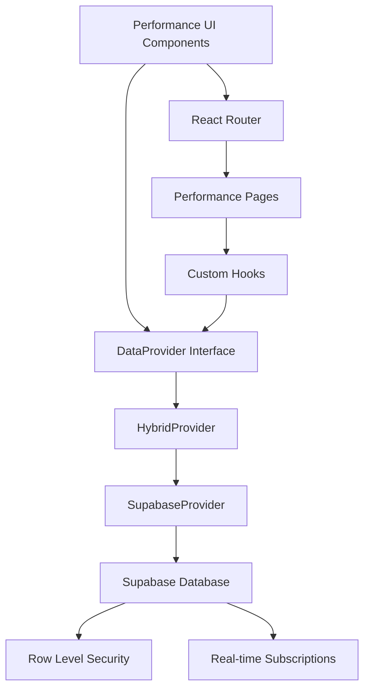
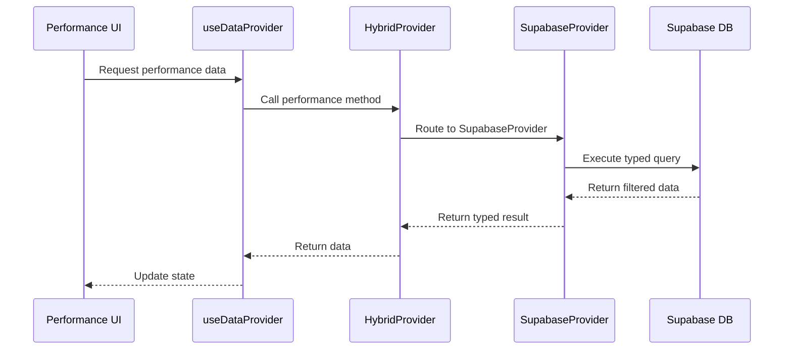

# Design Document: Operational Excellence Performance

## Overview

This document defines the design for Feature Set 1: Performance (OEE & Performance Tracking) of the Operational Excellence feature area for Power → Transmission. The Performance feature set provides comprehensive monitoring and analysis of transmission system performance through Overall Equipment Effectiveness (OEE) metrics, reliability tracking, loss analysis, and constraint identification.

The design follows the established Plant4.0 architecture with Supabase as the single source of truth (SSOT), implementing the Navigate → List → View → Edit (nLVE) pattern for all user interfaces, and extending the existing DataProvider contract for seamless integration.

## Architecture

### System Architecture

The Performance feature set integrates into the existing Plant4.0 architecture:



### Data Flow Architecture



## Components and Interfaces

### DataProvider Extensions

The existing DataProvider interface will be extended with performance-specific methods:

```typescript
interface PerformanceDataProvider extends DataProvider {
  // Performance Panels
  getPerformancePanelsByTenant(tenantId: string, filters?: PerformanceFilters): Promise<PerformancePanel[]>;
  getPerformancePanelById(panelId: string): Promise<PerformancePanel | null>;
  createPerformancePanel(tenantId: string, panel: CreatePerformancePanelRequest): Promise<PerformancePanel>;
  updatePerformancePanel(panelId: string, updates: UpdatePerformancePanelRequest): Promise<PerformancePanel>;
  deletePerformancePanel(panelId: string): Promise<void>;
  
  // Performance Losses
  getPerformanceLossesByTenant(tenantId: string, filters?: LossFilters): Promise<PerformanceLoss[]>;
  getPerformanceLossById(lossId: string): Promise<PerformanceLoss | null>;
  createPerformanceLoss(tenantId: string, loss: CreatePerformanceLossRequest): Promise<PerformanceLoss>;
  updatePerformanceLoss(lossId: string, updates: UpdatePerformanceLossRequest): Promise<PerformanceLoss>;
  
  // Performance Bottlenecks
  getPerformanceBottlenecksByTenant(tenantId: string, filters?: BottleneckFilters): Promise<PerformanceBottleneck[]>;
  getPerformanceBottleneckById(bottleneckId: string): Promise<PerformanceBottleneck | null>;
  createPerformanceBottleneck(tenantId: string, bottleneck: CreatePerformanceBottleneckRequest): Promise<PerformanceBottleneck>;
  updatePerformanceBottleneck(bottleneckId: string, updates: UpdatePerformanceBottleneckRequest): Promise<PerformanceBottleneck>;
  
  // Performance Trends
  getPerformanceTrendsByTenant(tenantId: string, filters: TrendFilters): Promise<PerformanceTrend[]>;
  
  // Performance Benchmarks
  getPerformanceBenchmarksByTenant(tenantId: string, filters?: BenchmarkFilters): Promise<PerformanceBenchmark[]>;
  
  // Performance Exports
  exportPerformanceData(tenantId: string, exportRequest: PerformanceExportRequest): Promise<ExportResult>;
}
```

### Core Type Definitions

```typescript
// Performance Panel Types
interface PerformancePanel {
  id: string;
  tenant_id: string;
  site_id?: string;
  asset_id?: string;
  grid_node_id?: string;
  grid_line_id?: string;
  name: string;
  panel_type: 'asset' | 'site' | 'system';
  
  // OEE Metrics
  oee_percentage: number;
  availability_percentage: number;
  performance_percentage: number;
  quality_percentage: number;
  
  // Transmission-Specific Metrics
  line_loading?: number;
  transformer_loading?: number;
  transmission_losses?: number;
  saidi?: number;
  saifi?: number;
  trip_count?: number;
  
  // Metadata
  status: 'active' | 'inactive' | 'maintenance';
  last_updated: string;
  created_at: string;
  updated_at: string;
}

// Performance Loss Types
interface PerformanceLoss {
  id: string;
  tenant_id: string;
  site_id?: string;
  asset_id?: string;
  grid_node_id?: string;
  grid_line_id?: string;
  
  loss_category: 'technical' | 'non_technical' | 'measurement_error';
  loss_type: string;
  description: string;
  
  // Loss Metrics
  duration_minutes: number;
  frequency_count: number;
  impact_percentage: number;
  energy_lost_mwh?: number;
  
  // Timestamps
  occurred_at: string;
  resolved_at?: string;
  created_at: string;
  updated_at: string;
}

// Performance Bottleneck Types
interface PerformanceBottleneck {
  id: string;
  tenant_id: string;
  site_id?: string;
  asset_id?: string;
  grid_node_id?: string;
  grid_line_id?: string;
  
  constraint_type: 'thermal' | 'voltage' | 'stability' | 'operational';
  severity: 'high' | 'medium' | 'low';
  description: string;
  
  // Constraint Metrics
  capacity_limit_mw?: number;
  current_loading_mw?: number;
  loading_percentage?: number;
  constraint_hours: number;
  
  // Status
  status: 'active' | 'resolved' | 'monitoring';
  resolution_notes?: string;
  
  created_at: string;
  updated_at: string;
  resolved_at?: string;
}

// Performance Trend Types
interface PerformanceTrend {
  id: string;
  tenant_id: string;
  metric_name: string;
  metric_value: number;
  timestamp: string;
  site_id?: string;
  asset_id?: string;
  grid_node_id?: string;
  grid_line_id?: string;
}

// Performance Benchmark Types
interface PerformanceBenchmark {
  id: string;
  tenant_id: string;
  benchmark_name: string;
  benchmark_type: 'site_comparison' | 'asset_comparison' | 'historical_comparison';
  
  // Benchmark Data
  entities: BenchmarkEntity[];
  metrics: BenchmarkMetric[];
  
  created_at: string;
  updated_at: string;
}

interface BenchmarkEntity {
  entity_id: string;
  entity_name: string;
  entity_type: 'site' | 'asset' | 'grid_node' | 'grid_line';
  rank: number;
  percentile: number;
}

interface BenchmarkMetric {
  metric_name: string;
  metric_value: number;
  target_value?: number;
  benchmark_value?: number;
}
```

### Filter and Request Types

```typescript
interface PerformanceFilters {
  site_ids?: string[];
  asset_ids?: string[];
  grid_node_ids?: string[];
  grid_line_ids?: string[];
  panel_types?: string[];
  status?: string[];
  oee_min?: number;
  oee_max?: number;
  date_from?: string;
  date_to?: string;
  limit?: number;
  offset?: number;
  sort_by?: string;
  sort_order?: 'asc' | 'desc';
}

interface CreatePerformancePanelRequest {
  name: string;
  panel_type: 'asset' | 'site' | 'system';
  site_id?: string;
  asset_id?: string;
  grid_node_id?: string;
  grid_line_id?: string;
  
  // Initial metrics (can be updated later)
  oee_percentage?: number;
  availability_percentage?: number;
  performance_percentage?: number;
  quality_percentage?: number;
}

interface UpdatePerformancePanelRequest {
  name?: string;
  oee_percentage?: number;
  availability_percentage?: number;
  performance_percentage?: number;
  quality_percentage?: number;
  line_loading?: number;
  transformer_loading?: number;
  transmission_losses?: number;
  saidi?: number;
  saifi?: number;
  trip_count?: number;
  status?: 'active' | 'inactive' | 'maintenance';
}
```

## Data Models

### Database Schema Design

The Performance feature set requires the following new tables in Supabase:

#### 1. performance_panels Table

```sql
CREATE TABLE performance_panels (
  id UUID PRIMARY KEY DEFAULT gen_random_uuid(),
  tenant_id UUID NOT NULL REFERENCES tenants(id) ON DELETE CASCADE,
  site_id UUID REFERENCES sites(id) ON DELETE SET NULL,
  asset_id UUID REFERENCES assets(id) ON DELETE SET NULL,
  grid_node_id UUID REFERENCES grid_nodes(id) ON DELETE SET NULL,
  grid_line_id UUID REFERENCES grid_lines(id) ON DELETE SET NULL,
  
  name TEXT NOT NULL,
  panel_type TEXT NOT NULL CHECK (panel_type IN ('asset', 'site', 'system')),
  
  -- OEE Metrics
  oee_percentage DOUBLE PRECISION DEFAULT 0 CHECK (oee_percentage >= 0 AND oee_percentage <= 100),
  availability_percentage DOUBLE PRECISION DEFAULT 0 CHECK (availability_percentage >= 0 AND availability_percentage <= 100),
  performance_percentage DOUBLE PRECISION DEFAULT 0 CHECK (performance_percentage >= 0 AND performance_percentage <= 100),
  quality_percentage DOUBLE PRECISION DEFAULT 0 CHECK (quality_percentage >= 0 AND quality_percentage <= 100),
  
  -- Transmission-Specific Metrics
  line_loading DOUBLE PRECISION CHECK (line_loading >= 0 AND line_loading <= 100),
  transformer_loading DOUBLE PRECISION CHECK (transformer_loading >= 0 AND transformer_loading <= 100),
  transmission_losses DOUBLE PRECISION CHECK (transmission_losses >= 0),
  saidi DOUBLE PRECISION CHECK (saidi >= 0),
  saifi DOUBLE PRECISION CHECK (saifi >= 0),
  trip_count INTEGER DEFAULT 0 CHECK (trip_count >= 0),
  
  -- Status and Metadata
  status TEXT DEFAULT 'active' CHECK (status IN ('active', 'inactive', 'maintenance')),
  last_updated TIMESTAMPTZ DEFAULT now(),
  created_at TIMESTAMPTZ DEFAULT now(),
  updated_at TIMESTAMPTZ DEFAULT now(),
  
  -- Constraints
  UNIQUE(tenant_id, name),
  CHECK (
    (panel_type = 'asset' AND asset_id IS NOT NULL) OR
    (panel_type = 'site' AND site_id IS NOT NULL) OR
    (panel_type = 'system' AND site_id IS NULL AND asset_id IS NULL)
  )
);
```

#### 2. performance_losses Table

```sql
CREATE TABLE performance_losses (
  id UUID PRIMARY KEY DEFAULT gen_random_uuid(),
  tenant_id UUID NOT NULL REFERENCES tenants(id) ON DELETE CASCADE,
  site_id UUID REFERENCES sites(id) ON DELETE SET NULL,
  asset_id UUID REFERENCES assets(id) ON DELETE SET NULL,
  grid_node_id UUID REFERENCES grid_nodes(id) ON DELETE SET NULL,
  grid_line_id UUID REFERENCES grid_lines(id) ON DELETE SET NULL,
  
  loss_category TEXT NOT NULL CHECK (loss_category IN ('technical', 'non_technical', 'measurement_error')),
  loss_type TEXT NOT NULL,
  description TEXT NOT NULL,
  
  -- Loss Metrics
  duration_minutes INTEGER NOT NULL CHECK (duration_minutes > 0),
  frequency_count INTEGER DEFAULT 1 CHECK (frequency_count > 0),
  impact_percentage DOUBLE PRECISION NOT NULL CHECK (impact_percentage >= 0 AND impact_percentage <= 100),
  energy_lost_mwh DOUBLE PRECISION CHECK (energy_lost_mwh >= 0),
  
  -- Timestamps
  occurred_at TIMESTAMPTZ NOT NULL,
  resolved_at TIMESTAMPTZ,
  created_at TIMESTAMPTZ DEFAULT now(),
  updated_at TIMESTAMPTZ DEFAULT now(),
  
  -- Constraints
  CHECK (resolved_at IS NULL OR resolved_at >= occurred_at)
);
```

#### 3. performance_bottlenecks Table

```sql
CREATE TABLE performance_bottlenecks (
  id UUID PRIMARY KEY DEFAULT gen_random_uuid(),
  tenant_id UUID NOT NULL REFERENCES tenants(id) ON DELETE CASCADE,
  site_id UUID REFERENCES sites(id) ON DELETE SET NULL,
  asset_id UUID REFERENCES assets(id) ON DELETE SET NULL,
  grid_node_id UUID REFERENCES grid_nodes(id) ON DELETE SET NULL,
  grid_line_id UUID REFERENCES grid_lines(id) ON DELETE SET NULL,
  
  constraint_type TEXT NOT NULL CHECK (constraint_type IN ('thermal', 'voltage', 'stability', 'operational')),
  severity TEXT NOT NULL CHECK (severity IN ('high', 'medium', 'low')),
  description TEXT NOT NULL,
  
  -- Constraint Metrics
  capacity_limit_mw DOUBLE PRECISION CHECK (capacity_limit_mw > 0),
  current_loading_mw DOUBLE PRECISION CHECK (current_loading_mw >= 0),
  loading_percentage DOUBLE PRECISION CHECK (loading_percentage >= 0 AND loading_percentage <= 200),
  constraint_hours INTEGER DEFAULT 0 CHECK (constraint_hours >= 0),
  
  -- Status
  status TEXT DEFAULT 'active' CHECK (status IN ('active', 'resolved', 'monitoring')),
  resolution_notes TEXT,
  
  created_at TIMESTAMPTZ DEFAULT now(),
  updated_at TIMESTAMPTZ DEFAULT now(),
  resolved_at TIMESTAMPTZ,
  
  -- Constraints
  CHECK (status != 'resolved' OR resolved_at IS NOT NULL),
  CHECK (current_loading_mw IS NULL OR capacity_limit_mw IS NULL OR current_loading_mw <= capacity_limit_mw * 2)
);
```

#### 4. performance_trends Table

```sql
CREATE TABLE performance_trends (
  id UUID PRIMARY KEY DEFAULT gen_random_uuid(),
  tenant_id UUID NOT NULL REFERENCES tenants(id) ON DELETE CASCADE,
  site_id UUID REFERENCES sites(id) ON DELETE SET NULL,
  asset_id UUID REFERENCES assets(id) ON DELETE SET NULL,
  grid_node_id UUID REFERENCES grid_nodes(id) ON DELETE SET NULL,
  grid_line_id UUID REFERENCES grid_lines(id) ON DELETE SET NULL,
  
  metric_name TEXT NOT NULL,
  metric_value DOUBLE PRECISION NOT NULL,
  timestamp TIMESTAMPTZ NOT NULL,
  
  created_at TIMESTAMPTZ DEFAULT now(),
  
  -- Unique constraint to prevent duplicate metrics
  UNIQUE(tenant_id, metric_name, timestamp, COALESCE(site_id::text, ''), COALESCE(asset_id::text, ''), COALESCE(grid_node_id::text, ''), COALESCE(grid_line_id::text, ''))
);
```

#### 5. performance_benchmarks Table

```sql
CREATE TABLE performance_benchmarks (
  id UUID PRIMARY KEY DEFAULT gen_random_uuid(),
  tenant_id UUID NOT NULL REFERENCES tenants(id) ON DELETE CASCADE,
  
  benchmark_name TEXT NOT NULL,
  benchmark_type TEXT NOT NULL CHECK (benchmark_type IN ('site_comparison', 'asset_comparison', 'historical_comparison')),
  benchmark_data JSONB NOT NULL DEFAULT '{}',
  
  created_at TIMESTAMPTZ DEFAULT now(),
  updated_at TIMESTAMPTZ DEFAULT now(),
  
  UNIQUE(tenant_id, benchmark_name)
);
```

### Indexes and Performance Optimization

```sql
-- Performance Panels Indexes
CREATE INDEX idx_performance_panels_tenant ON performance_panels(tenant_id);
CREATE INDEX idx_performance_panels_site ON performance_panels(site_id);
CREATE INDEX idx_performance_panels_asset ON performance_panels(asset_id);
CREATE INDEX idx_performance_panels_grid_node ON performance_panels(grid_node_id);
CREATE INDEX idx_performance_panels_grid_line ON performance_panels(grid_line_id);
CREATE INDEX idx_performance_panels_type ON performance_panels(panel_type);
CREATE INDEX idx_performance_panels_status ON performance_panels(status);
CREATE INDEX idx_performance_panels_oee ON performance_panels(oee_percentage);
CREATE INDEX idx_performance_panels_updated ON performance_panels(last_updated);

-- Performance Losses Indexes
CREATE INDEX idx_performance_losses_tenant ON performance_losses(tenant_id);
CREATE INDEX idx_performance_losses_category ON performance_losses(loss_category);
CREATE INDEX idx_performance_losses_occurred ON performance_losses(occurred_at);
CREATE INDEX idx_performance_losses_impact ON performance_losses(impact_percentage);

-- Performance Bottlenecks Indexes
CREATE INDEX idx_performance_bottlenecks_tenant ON performance_bottlenecks(tenant_id);
CREATE INDEX idx_performance_bottlenecks_severity ON performance_bottlenecks(severity);
CREATE INDEX idx_performance_bottlenecks_status ON performance_bottlenecks(status);
CREATE INDEX idx_performance_bottlenecks_type ON performance_bottlenecks(constraint_type);

-- Performance Trends Indexes
CREATE INDEX idx_performance_trends_tenant ON performance_trends(tenant_id);
CREATE INDEX idx_performance_trends_metric ON performance_trends(metric_name);
CREATE INDEX idx_performance_trends_timestamp ON performance_trends(timestamp);
CREATE INDEX idx_performance_trends_composite ON performance_trends(tenant_id, metric_name, timestamp);

-- Performance Benchmarks Indexes
CREATE INDEX idx_performance_benchmarks_tenant ON performance_benchmarks(tenant_id);
CREATE INDEX idx_performance_benchmarks_type ON performance_benchmarks(benchmark_type);
```

### Row Level Security (RLS) Policies

```sql
-- Enable RLS on all performance tables
ALTER TABLE performance_panels ENABLE ROW LEVEL SECURITY;
ALTER TABLE performance_losses ENABLE ROW LEVEL SECURITY;
ALTER TABLE performance_bottlenecks ENABLE ROW LEVEL SECURITY;
ALTER TABLE performance_trends ENABLE ROW LEVEL SECURITY;
ALTER TABLE performance_benchmarks ENABLE ROW LEVEL SECURITY;

-- RLS Policies for performance_panels
CREATE POLICY "Users can view performance panels for their tenant" ON performance_panels
  FOR SELECT USING (tenant_id = current_setting('app.current_tenant_id')::uuid);

CREATE POLICY "Users can insert performance panels for their tenant" ON performance_panels
  FOR INSERT WITH CHECK (tenant_id = current_setting('app.current_tenant_id')::uuid);

CREATE POLICY "Users can update performance panels for their tenant" ON performance_panels
  FOR UPDATE USING (tenant_id = current_setting('app.current_tenant_id')::uuid);

CREATE POLICY "Users can delete performance panels for their tenant" ON performance_panels
  FOR DELETE USING (tenant_id = current_setting('app.current_tenant_id')::uuid);

-- Similar policies for other tables (performance_losses, performance_bottlenecks, etc.)
```

## UI Structure and Routes

### Route Structure

The Performance feature set implements the following routes following nLVE patterns:

```
/optimise/performance                    # List + View + Edit (Main dashboard)
├── /optimise/performance/losses         # List + View (Loss analysis)
├── /optimise/performance/bottlenecks    # List + View + Edit (Constraint management)
├── /optimise/performance/trends         # View (Trend analysis)
└── /optimise/performance/benchmarks     # List + View (Benchmarking)
```

### Page Components Structure

```typescript
// Main Performance Pages
const PerformanceOverviewPage = () => {
  // Navigate: Breadcrumb navigation
  // List: Performance panels table with filters
  // View: Selected panel details with KPIs
  // Edit: Panel configuration form
};

const PerformanceLossesPage = () => {
  // Navigate: Breadcrumb navigation
  // List: Losses table with category filters
  // View: Loss details and impact analysis
};

const PerformanceBottlenecksPage = () => {
  // Navigate: Breadcrumb navigation  
  // List: Bottlenecks table with severity filters
  // View: Constraint details and resolution tracking
  // Edit: Constraint update and resolution forms
};

const PerformanceTrendsPage = () => {
  // Navigate: Breadcrumb navigation
  // View: Trend charts and analysis dashboard
};

const PerformanceBenchmarksPage = () => {
  // Navigate: Breadcrumb navigation
  // List: Available benchmarks
  // View: Benchmark results and comparisons
};
```

### Component Hierarchy

```
PerformanceLayout
├── PerformanceNavigation (breadcrumbs, tabs)
├── PerformanceFilters (common filters)
└── PerformanceContent
    ├── PerformanceList (tables, pagination)
    ├── PerformanceView (details, KPIs, charts)
    └── PerformanceEdit (forms, validation)
```

### Key UI Components

#### Performance Panel Card
```typescript
interface PerformancePanelCardProps {
  panel: PerformancePanel;
  onSelect: (panel: PerformancePanel) => void;
  onEdit: (panel: PerformancePanel) => void;
}

const PerformancePanelCard: React.FC<PerformancePanelCardProps> = ({
  panel,
  onSelect,
  onEdit
}) => {
  return (
    <Card className="performance-panel-card">
      <CardHeader>
        <CardTitle>{panel.name}</CardTitle>
        <Badge variant={getStatusVariant(panel.status)}>
          {panel.status}
        </Badge>
      </CardHeader>
      <CardContent>
        <div className="oee-metrics">
          <MetricTile 
            label="OEE" 
            value={panel.oee_percentage} 
            unit="%" 
            trend="up"
          />
          <MetricTile 
            label="Availability" 
            value={panel.availability_percentage} 
            unit="%" 
          />
          <MetricTile 
            label="Performance" 
            value={panel.performance_percentage} 
            unit="%" 
          />
          <MetricTile 
            label="Quality" 
            value={panel.quality_percentage} 
            unit="%" 
          />
        </div>
        
        {panel.line_loading && (
          <div className="transmission-metrics">
            <MetricTile 
              label="Line Loading" 
              value={panel.line_loading} 
              unit="%" 
              threshold={80}
            />
          </div>
        )}
      </CardContent>
      <CardActions>
        <Button variant="outline" onClick={() => onSelect(panel)}>
          View Details
        </Button>
        <Button variant="default" onClick={() => onEdit(panel)}>
          Edit
        </Button>
      </CardActions>
    </Card>
  );
};
```

#### Performance Metrics Dashboard
```typescript
const PerformanceMetricsDashboard: React.FC<{
  panels: PerformancePanel[];
  trends: PerformanceTrend[];
}> = ({ panels, trends }) => {
  return (
    <div className="performance-dashboard">
      <div className="kpi-summary">
        <KPITile 
          title="Average OEE" 
          value={calculateAverageOEE(panels)} 
          unit="%" 
          target={85}
        />
        <KPITile 
          title="System Availability" 
          value={calculateSystemAvailability(panels)} 
          unit="%" 
          target={99.5}
        />
        <KPITile 
          title="Active Constraints" 
          value={countActiveConstraints(panels)} 
          unit="" 
        />
        <KPITile 
          title="Total Losses" 
          value={calculateTotalLosses(panels)} 
          unit="MWh" 
        />
      </div>
      
      <div className="trend-charts">
        <TrendChart 
          title="OEE Trend" 
          data={trends.filter(t => t.metric_name === 'oee')} 
          timeRange="7d"
        />
        <TrendChart 
          title="Loss Trend" 
          data={trends.filter(t => t.metric_name === 'losses')} 
          timeRange="7d"
        />
      </div>
    </div>
  );
};
```

## Correctness Properties

*A property is a characteristic or behavior that should hold true across all valid executions of a system—essentially, a formal statement about what the system should do. Properties serve as the bridge between human-readable specifications and machine-verifiable correctness guarantees.*

Based on the requirements analysis, the following correctness properties must be validated through property-based testing:

### Property 1: Performance Panel Data Integrity
*For any* performance panel with valid OEE components (availability, performance, quality), the calculated OEE percentage should equal the product of the three component percentages divided by 10,000 (since each is a percentage).
**Validates: Requirements 1.5**

### Property 2: Performance Panel Filtering Consistency  
*For any* set of performance panels and any valid filter criteria, applying the filter should return only panels that match all specified criteria, and the result set should be a subset of the original panels.
**Validates: Requirements 1.6**

### Property 3: Transmission Loss Impact Calculation
*For any* transmission loss record with valid duration and frequency, the total impact should be calculable and the impact percentage should be between 0 and 100 percent.
**Validates: Requirements 3.3**

### Property 4: Loss Category Validation
*For any* loss record, the loss category should be one of the predefined valid categories (technical, non-technical, measurement_error), and the system should reject any loss with an invalid category.
**Validates: Requirements 3.1, 3.4**

### Property 5: Bottleneck Severity Classification
*For any* bottleneck with loading percentage above 80%, the system should classify it as a constraint, and bottlenecks with loading above 95% should be classified as high severity.
**Validates: Requirements 4.1, 4.2**

### Property 6: Constraint Resolution State Consistency
*For any* bottleneck marked as resolved, there must be a resolution timestamp and resolution notes, and the resolved timestamp must be after the creation timestamp.
**Validates: Requirements 4.5**

### Property 7: Reliability Metrics Calculation
*For any* set of outage events, the calculated SAIDI should equal the sum of (customer interruption duration × customers affected) divided by total customers served, expressed in minutes per customer per year.
**Validates: Requirements 5.2**

### Property 8: Outage Event Recording
*For any* outage event with valid start and end times, the system should automatically create an incident record with the correct timestamp and the outage duration should be positive.
**Validates: Requirements 5.6**

### Property 9: Trend Data Temporal Consistency
*For any* performance trend data, timestamps should be in chronological order when sorted, and there should be no duplicate entries for the same metric, entity, and timestamp combination.
**Validates: Requirements 6.1, 6.2**

### Property 10: Benchmark Ranking Consistency
*For any* benchmark comparison with multiple entities, the ranking should be consistent with the metric values (higher performance metrics should result in better rankings), and percentile calculations should be mathematically correct.
**Validates: Requirements 7.1, 7.4**

### Property 11: Data Export Completeness
*For any* export request with specified date ranges and entities, the exported data should contain all records matching the criteria and include all requested fields with proper formatting.
**Validates: Requirements 8.1, 8.2**

### Property 12: Real-time Data Update Consistency
*For any* performance data update, the system should update the last_updated timestamp and maintain data consistency across related entities (e.g., site-level aggregations should reflect asset-level changes).
**Validates: Requirements 9.1, 9.4**

### Property 13: Tenant Data Isolation
*For any* data access request, the system should only return data belonging to the specified tenant, and cross-tenant data access should be prevented by Row Level Security policies.
**Validates: Requirements 10.1 (implied security requirement)**

## Error Handling

### Error Categories and Handling Strategies

#### 1. Data Validation Errors
```typescript
class PerformanceValidationError extends Error {
  constructor(
    public field: string,
    public value: any,
    public constraint: string
  ) {
    super(`Validation failed for ${field}: ${constraint}`);
  }
}

// Example validations
const validateOEEPercentage = (value: number): void => {
  if (value < 0 || value > 100) {
    throw new PerformanceValidationError('oee_percentage', value, 'must be between 0 and 100');
  }
};

const validateLossCategory = (category: string): void => {
  const validCategories = ['technical', 'non_technical', 'measurement_error'];
  if (!validCategories.includes(category)) {
    throw new PerformanceValidationError('loss_category', category, `must be one of: ${validCategories.join(', ')}`);
  }
};
```

#### 2. Database Connection Errors
```typescript
class PerformanceDatabaseError extends Error {
  constructor(
    public operation: string,
    public originalError: Error
  ) {
    super(`Database operation failed: ${operation}`);
  }
}

// Error handling in SupabaseProvider
const handleDatabaseError = (error: any, operation: string): never => {
  console.error(`Database error in ${operation}:`, error);
  
  if (error.code === 'PGRST116') {
    throw new PerformanceDatabaseError(operation, new Error('No data found'));
  }
  
  if (error.code === '23505') {
    throw new PerformanceDatabaseError(operation, new Error('Duplicate entry'));
  }
  
  throw new PerformanceDatabaseError(operation, error);
};
```

#### 3. Permission and Access Errors
```typescript
class PerformanceAccessError extends Error {
  constructor(
    public resource: string,
    public action: string,
    public tenantId: string
  ) {
    super(`Access denied: ${action} on ${resource} for tenant ${tenantId}`);
  }
}

// RLS policy enforcement
const checkTenantAccess = (tenantId: string, userTenantId: string): void => {
  if (tenantId !== userTenantId) {
    throw new PerformanceAccessError('performance_panel', 'read', tenantId);
  }
};
```

#### 4. UI Error Boundaries
```typescript
class PerformanceErrorBoundary extends React.Component<
  { children: React.ReactNode },
  { hasError: boolean; error?: Error }
> {
  constructor(props: { children: React.ReactNode }) {
    super(props);
    this.state = { hasError: false };
  }

  static getDerivedStateFromError(error: Error) {
    return { hasError: true, error };
  }

  componentDidCatch(error: Error, errorInfo: React.ErrorInfo) {
    console.error('Performance component error:', error, errorInfo);
    // Log to monitoring service
  }

  render() {
    if (this.state.hasError) {
      return (
        <div className="error-boundary">
          <h2>Something went wrong with the performance dashboard</h2>
          <p>Please refresh the page or contact support if the problem persists.</p>
          <Button onClick={() => this.setState({ hasError: false })}>
            Try Again
          </Button>
        </div>
      );
    }

    return this.props.children;
  }
}
```

### Error Recovery Strategies

#### 1. Automatic Retry Logic
```typescript
const withRetry = async <T>(
  operation: () => Promise<T>,
  maxRetries: number = 3,
  delay: number = 1000
): Promise<T> => {
  for (let attempt = 1; attempt <= maxRetries; attempt++) {
    try {
      return await operation();
    } catch (error) {
      if (attempt === maxRetries) {
        throw error;
      }
      
      console.warn(`Attempt ${attempt} failed, retrying in ${delay}ms...`);
      await new Promise(resolve => setTimeout(resolve, delay));
      delay *= 2; // Exponential backoff
    }
  }
  
  throw new Error('Max retries exceeded');
};
```

#### 2. Graceful Degradation
```typescript
const PerformanceDashboard: React.FC = () => {
  const [panels, setPanels] = useState<PerformancePanel[]>([]);
  const [loading, setLoading] = useState(true);
  const [error, setError] = useState<string | null>(null);

  useEffect(() => {
    const loadPerformanceData = async () => {
      try {
        setLoading(true);
        setError(null);
        
        const data = await withRetry(() => 
          dataProvider.getPerformancePanelsByTenant(tenantId)
        );
        
        setPanels(data);
      } catch (err) {
        console.error('Failed to load performance data:', err);
        setError('Unable to load performance data. Showing cached data.');
        
        // Try to load cached data
        const cachedData = getCachedPerformanceData(tenantId);
        if (cachedData) {
          setPanels(cachedData);
        }
      } finally {
        setLoading(false);
      }
    };

    loadPerformanceData();
  }, [tenantId]);

  if (loading) {
    return <PerformanceLoadingSkeleton />;
  }

  return (
    <div className="performance-dashboard">
      {error && (
        <Alert variant="warning">
          <AlertTriangle className="h-4 w-4" />
          <AlertTitle>Data Loading Issue</AlertTitle>
          <AlertDescription>{error}</AlertDescription>
        </Alert>
      )}
      
      <PerformanceMetricsDashboard panels={panels} />
    </div>
  );
};
```

## Testing Strategy

### Dual Testing Approach

The Performance feature set requires comprehensive testing using both unit tests and property-based tests to ensure correctness and reliability.

#### Unit Testing Strategy

Unit tests focus on specific examples, edge cases, and integration points:

**Test Categories:**
- **Component Tests**: React component rendering and user interactions
- **Provider Tests**: DataProvider method implementations and error handling  
- **Validation Tests**: Input validation and business rule enforcement
- **Integration Tests**: End-to-end workflows and data flow

**Key Unit Test Examples:**
```typescript
describe('PerformancePanel Validation', () => {
  it('should calculate OEE correctly from components', () => {
    const panel = createTestPanel({
      availability_percentage: 90,
      performance_percentage: 85,
      quality_percentage: 95
    });
    
    const expectedOEE = (90 * 85 * 95) / 10000;
    expect(calculateOEE(panel)).toBeCloseTo(expectedOEE, 2);
  });

  it('should reject invalid OEE percentages', () => {
    expect(() => validateOEEPercentage(-5)).toThrow(PerformanceValidationError);
    expect(() => validateOEEPercentage(105)).toThrow(PerformanceValidationError);
  });

  it('should handle missing optional fields gracefully', () => {
    const panel = createTestPanel({ line_loading: undefined });
    expect(() => validatePerformancePanel(panel)).not.toThrow();
  });
});

describe('SupabaseProvider Performance Methods', () => {
  it('should filter panels by tenant correctly', async () => {
    const panels = await provider.getPerformancePanelsByTenant('tenant-1');
    expect(panels.every(p => p.tenant_id === 'tenant-1')).toBe(true);
  });

  it('should handle database connection errors', async () => {
    mockSupabase.from.mockReturnValue({
      select: () => ({ eq: () => Promise.reject(new Error('Connection failed')) })
    });

    await expect(provider.getPerformancePanelsByTenant('tenant-1'))
      .rejects.toThrow(PerformanceDatabaseError);
  });
});
```

#### Property-Based Testing Strategy

Property-based tests verify universal properties across randomized inputs using a minimum of 100 iterations per test:

**Property Test Configuration:**
- **Library**: fast-check (for TypeScript/JavaScript)
- **Iterations**: 100 minimum per property test
- **Generators**: Custom generators for domain-specific data
- **Shrinking**: Automatic counterexample minimization

**Property Test Implementation:**
```typescript
import fc from 'fast-check';

describe('Performance Properties', () => {
  it('Property 1: OEE calculation consistency', () => {
    fc.assert(fc.property(
      fc.record({
        availability_percentage: fc.float({ min: 0, max: 100 }),
        performance_percentage: fc.float({ min: 0, max: 100 }),
        quality_percentage: fc.float({ min: 0, max: 100 })
      }),
      (components) => {
        const expectedOEE = (components.availability_percentage * 
                           components.performance_percentage * 
                           components.quality_percentage) / 10000;
        
        const calculatedOEE = calculateOEE(components);
        
        return Math.abs(calculatedOEE - expectedOEE) < 0.01;
      }
    ), { numRuns: 100 });
  });

  it('Property 2: Filter consistency', () => {
    fc.assert(fc.property(
      fc.array(performancePanelGenerator()),
      fc.record({
        site_ids: fc.option(fc.array(fc.uuid())),
        oee_min: fc.option(fc.float({ min: 0, max: 100 })),
        status: fc.option(fc.constantFrom('active', 'inactive', 'maintenance'))
      }),
      (panels, filters) => {
        const filtered = applyPerformanceFilters(panels, filters);
        
        // All filtered results should match the filter criteria
        return filtered.every(panel => {
          if (filters.site_ids && !filters.site_ids.includes(panel.site_id)) return false;
          if (filters.oee_min && panel.oee_percentage < filters.oee_min) return false;
          if (filters.status && panel.status !== filters.status) return false;
          return true;
        });
      }
    ), { numRuns: 100 });
  });

  it('Property 7: SAIDI calculation correctness', () => {
    fc.assert(fc.property(
      fc.array(outageEventGenerator()),
      fc.integer({ min: 1000, max: 1000000 }), // total customers
      (outages, totalCustomers) => {
        const calculatedSAIDI = calculateSAIDI(outages, totalCustomers);
        
        // Manual calculation for verification
        const totalCustomerMinutes = outages.reduce((sum, outage) => 
          sum + (outage.duration_minutes * outage.customers_affected), 0);
        const expectedSAIDI = totalCustomerMinutes / totalCustomers;
        
        return Math.abs(calculatedSAIDI - expectedSAIDI) < 0.001;
      }
    ), { numRuns: 100 });
  });
});

// Custom generators for domain-specific data
const performancePanelGenerator = () => fc.record({
  id: fc.uuid(),
  tenant_id: fc.uuid(),
  name: fc.string({ minLength: 1, maxLength: 100 }),
  panel_type: fc.constantFrom('asset', 'site', 'system'),
  oee_percentage: fc.float({ min: 0, max: 100 }),
  availability_percentage: fc.float({ min: 0, max: 100 }),
  performance_percentage: fc.float({ min: 0, max: 100 }),
  quality_percentage: fc.float({ min: 0, max: 100 }),
  status: fc.constantFrom('active', 'inactive', 'maintenance'),
  created_at: fc.date().map(d => d.toISOString()),
  updated_at: fc.date().map(d => d.toISOString())
});

const outageEventGenerator = () => fc.record({
  duration_minutes: fc.integer({ min: 1, max: 10080 }), // 1 minute to 1 week
  customers_affected: fc.integer({ min: 1, max: 100000 }),
  occurred_at: fc.date().map(d => d.toISOString())
});
```

**Test Tagging and Traceability:**
Each property test must include a comment linking it to the design document property:

```typescript
// Feature: operational-excellence-performance, Property 1: OEE calculation consistency
it('Property 1: OEE calculation consistency', () => { ... });

// Feature: operational-excellence-performance, Property 7: SAIDI calculation correctness  
it('Property 7: SAIDI calculation correctness', () => { ... });
```

### Test Environment and Data

**Test Database Setup:**
- Isolated test database with clean schema
- Seeded with minimal test data for each test suite
- Automatic cleanup between test runs

**Mock Data Strategy:**
- Generate realistic test data using factories
- Use property-based generators for comprehensive coverage
- Maintain referential integrity in test data

**Performance Testing:**
- Load testing with large datasets (1000+ panels)
- Response time validation (< 2 seconds for list views)
- Memory usage monitoring during bulk operations

## Future Feature Set Integration

### Planned Integration Points

The Performance feature set is designed to integrate seamlessly with the remaining Operational Excellence feature sets:

#### Feature Set 2: Lean Execution (SIM) Integration
- **Performance → SIM Issues**: Automatically create SIM issues when performance thresholds are breached
- **Shared Metrics**: Performance panels feed into SIM board KPIs
- **Event Correlation**: Link performance events to SIM event logs

#### Feature Set 3: Continuous Improvement (CI) Integration  
- **Performance → CI Projects**: Performance bottlenecks can spawn CI improvement projects
- **Impact Tracking**: CI projects track before/after performance metrics
- **Root Cause Analysis**: Performance losses link to RCA workspace

#### Feature Set 4: AI-Assisted Optimisation Integration
- **Performance Data Input**: Performance metrics feed AI opportunity identification
- **Optimization Tracking**: Track performance impact of implemented optimizations
- **Predictive Analytics**: Use performance trends for predictive maintenance

### Data Model Extensions

Future feature sets will extend the performance data model:

```typescript
// Extensions for SIM integration
interface PerformancePanel {
  // ... existing fields
  sim_board_id?: string;           // Link to SIM board
  last_sim_issue_id?: string;      // Last generated SIM issue
  threshold_config?: ThresholdConfig; // Alert thresholds
}

// Extensions for CI integration  
interface PerformanceLoss {
  // ... existing fields
  ci_project_id?: string;          // Related CI project
  root_cause_id?: string;          // Link to RCA
  improvement_status?: string;     // Improvement tracking
}

// Extensions for AI integration
interface PerformanceBottleneck {
  // ... existing fields
  ai_opportunity_id?: string;      // AI-identified opportunity
  optimization_score?: number;    // AI optimization potential
  prediction_confidence?: number; // AI confidence level
}
```

### API Evolution Strategy

The DataProvider interface will be extended incrementally:

```typescript
// Phase 2: SIM Integration
interface SIMIntegratedDataProvider extends PerformanceDataProvider {
  createSIMIssueFromPerformance(panelId: string, thresholdBreach: ThresholdBreach): Promise<SIMIssue>;
  linkPerformancePanelToSIMBoard(panelId: string, boardId: string): Promise<void>;
}

// Phase 3: CI Integration  
interface CIIntegratedDataProvider extends SIMIntegratedDataProvider {
  createCIProjectFromBottleneck(bottleneckId: string, projectTemplate: CIProjectTemplate): Promise<CIProject>;
  trackPerformanceImpact(projectId: string, beforeMetrics: PerformanceMetrics, afterMetrics: PerformanceMetrics): Promise<void>;
}

// Phase 4: AI Integration
interface AIIntegratedDataProvider extends CIIntegratedDataProvider {
  getAIOptimizationOpportunities(tenantId: string, performanceData: PerformanceData[]): Promise<OptimizationOpportunity[]>;
  recordOptimizationOutcome(opportunityId: string, actualImpact: PerformanceImpact): Promise<void>;
}
```

This design ensures that the Performance feature set provides a solid foundation for the complete Operational Excellence feature area while maintaining clean separation of concerns and enabling incremental development.